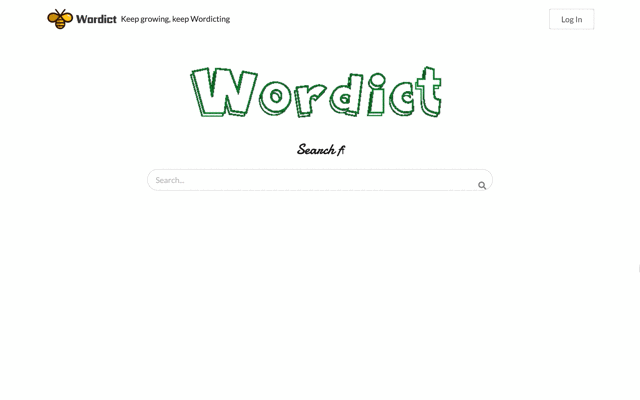

# [Wordict](https://wordict.herokuapp.com/)

## Author
- [Karen Cao](https://qimincao.github.io/HomePage_Karen/)
- [Freddy Lyu](https://freddydoesit.github.io/freddy/)

## Screenshot


## Project Objective

This web app helps non-native speaker to learn English. Sometimes when we read or listen to others, there might be a word / words that we may be not familiar with. So with this app, we can search it. This app differs from traditional online dics. It integrates the searching functionality and the word list. So user can have access to his/her own searching history for review, also there will be review test to make it more interesting.

CS5610 Course Link: http://johnguerra.co/classes/webDevelopment_spring_2019/ 

## Usage

First please make sure you have installed meteor, mongoDB, and React.

Then run the following commands in your terminal.

```
git clone https://github.com/FreddyDoesIT/dictionary.git
cd dictionary
meteor npm install
meteor
```
Open your browser and visit http://localhost:3000 and you should see the application.

## Technologies

- Platform: [Meteor](https://www.meteor.com/) with React - An open source platform for 
web, mobile, and desktop.
- UI: [Semantic UI](https://semantic-ui.com/) - A development framework that helps create beautiful, responsive layouts using human-friendly HTML.
- JavaScript library: typed.js, simpl-schema.js
- API: [WordsAPI](https://www.wordsapi.com/) - An API for the English Language.


## Video and Slides
Video demo of this project can be found [here](https://youtu.be/dCcqpMeR9v0). 

Slide of this project can be found [here](https://docs.google.com/presentation/d/1Tzng8xJW8sIhq7SMrlvwhkd_7mSFzrwZkiLnkMPYjxQ/edit#slide=id.g5591a3b83a_0_105).


## License
[](https://opensource.org/licenses/MIT)

This repository has the standard [MIT license](https://opensource.org/licenses/MIT). 